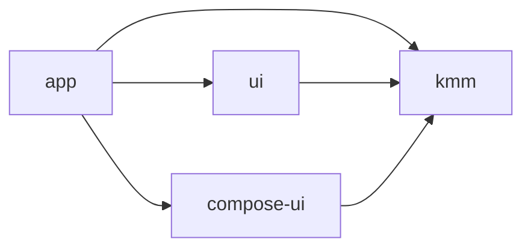

# GithubRepositories

Githubのpublicリポジトリを一覧表示するサンプルアプリ

## アプリ外観

## アーキテクチャ

- MVVM + マルチモジュール + Repositoryパターン
- domain層より下の階層の内容は[KMMライブラリ](https://github.com/nemo-855/GithubRepositories-KMM)として切り出して、使用している

## モジュール構成
- app
  - Applicationクラスを保持するmodule。全モジュールに依存し、DIの管理等を担う。
- compose-ui
  - Jetpack Compse用のui module。構造が大きくなってきたら、compose-uiモジュールをさらにfeature毎に縦分割していく予定。
- ui
  - AndroidView用のui module。
- kmm
  - KMMライブラリへの直接的な依存を閉じ込めるためのモジュール。KMMへの参照を行いたいモジュールはこのKMMモジュールに依存させる。
  

[^1]
[^1]: 矢印の向きが依存の向きです

## 開発規則

### ブランチ戦略

GitHub flow

### コミット規則

- feat: 新しい機能
- fix: バグの修正
- docs: ドキュメントのみの変更
- style: 空白、フォーマット、セミコロン追加など
- refactor: 仕様に影響がないコード改善(リファクタ)
- perf: パフォーマンス向上関連
- test: テスト関連
- chore: ビルド、補助ツール、ライブラリ関連

## 使用技術

### Kotlin
- Coroutines
- Serialization

### DIコンテナ
- Dagger Hilt
- (KMMライブラリ側)Koin

### UIライブラリ
- Jetpack Compose
- Groupie

### Http通信
- (KMMライブラリ側)Ktor Client

## 画像処理
- Coil

### Jetpack
- Navigation Component

### Unit Test
- Mockk
- Truth
- Junit4

 
    
